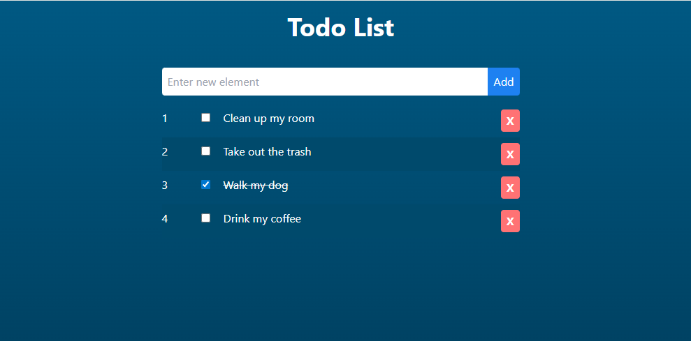

# todo-app-vue

The Todo List application built using React. The application implements web development technologies such as React, TypeScript, Vite, Tailwind CSS, React Hook Form, and Immer to provide a seamless user experience.

Live demo: https://mf256.github.io/todo-react

## Table of contents

- [General info](#general-info)
- [Technologies](#technologies)
- [Features](#features)
- [Screenshots](#screenshots)
- [Setup](#setup)
- [Status](#status)
- [License](#license)

## General info

The primary goal of this project is to develop a straightforward Todo List application utilizing the React framework and other web development technologies.

## Technologies

- [React](https://react.dev)
- [TypeScript](https://www.typescriptlang.org)
- [Vite](https://vitejs.dev)
- [Tailwind CSS](https://tailwindcss.com)
- [React Hook Form](https://github.com/react-hook-form/react-hook-form)
- [Immer](https://github.com/immerjs/immer)
- [Prettier](https://prettier.io)
- [ESLint](https://eslint.org)

## Features

- Add new item
- Set item as done
- Remove item

## Screenshots

## Setup

How to run this project.

1. Clone this repo

2. To run, go to project folder and run

`$ npm install`

3. Now start dev server by running -

`$ npm run start`

4. visit - http://localhost:3000/

To create production ready codes -

`$ npm run build`

for more commands refer `package.json`

## Status

Project is finished.

## License

MIT
